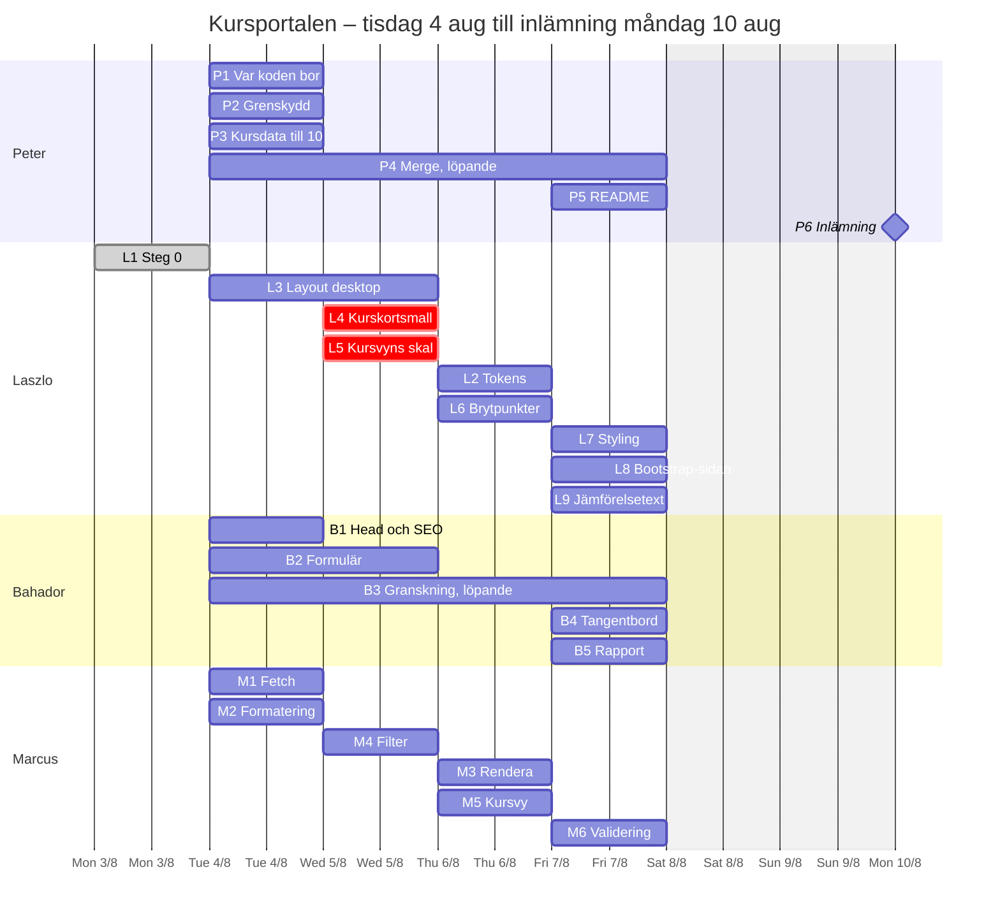

# Arbetsplan – kursportalen, grupp 2

Från kickoff tisdag 4 augusti till inlämning måndag 10 augusti kl. 17:00.

Läs den så här: stegen är numrerade i den ordning de blir möjliga, inte i den
ordning de måste göras. Fyra spår löper parallellt. Markörerna betyder:

- 🔒 **blockerad av** – går inte att börja innan det som nämns är klart
- ⚡ **parallellt** – kan köras samtidigt som något annat, av någon annan
- ⚠️ **fallgrop** – något som kostar en halvdag om man går på det

---

## Var designen finns

| | Länk |
|---|---|
| Fem designriktningar, var och en i 1440, 768 och 390. Börja på *Start här* | [Figma – designriktningar](https://www.figma.com/design/5fB1ucR6IIVb2L0zjoBJtO/Nordkod-%E2%80%93-designriktningar?node-id=0-1) |
| Flödet genom sajten och rollfördelningen | [FigJam – flöde och struktur](https://www.figma.com/board/loIXYG4nLXtV0o6mEMFXik/Nordkod-%E2%80%93-fl%C3%B6de-och-struktur) |

I designfilen finns också sidan *Layout – struktur*: tre skelett i gråskala,
var och en i tre brytpunkter. Den säger vad som ska hända vid 768 – att
kortrutnätet går från fyra till två kolumner, att filtret flyttar upp, att
modulraderna tappar sin portkolumn. Titta där innan ni bygger brytpunkterna,
så slipper ni fatta samma beslut tre gånger.

---

## Det som redan är bestämt

Fem beslut är fattade och skrivna. Ifrågasätt dem gärna på kickoffen, men gör
det då – inte på torsdag.

| Beslut | Var |
|---|---|
| En sida. Kursvyn glider in från höger och har egen adress `?kurs=<id>` | `docs/adr/0001` |
| Kurskortet bor i ett `<template>`, JavaScript skriver aldrig klassnamn | `docs/adr/0002` |
| Bootstrap får en egen sida som delar data, tokens och logik | `docs/adr/0003` |
| `index.html` delas mellan Laszlo och Bahador, med tydliga ytor | `docs/adr/0004` |
| Tailwind och Bootstrap laddas från CDN, som i kursens övningar | – |

Ordlistan finns i `CONTEXT.md`. Dataformen i `docs/kursdata.md`. Filstruktur
och ägarskap i `docs/filstruktur.md`.

## Det som inte är bestämt

Fyra frågor. De tar tjugo minuter tillsammans och blockerar annars folk mitt i
veckan.

| # | Fråga | Blockerar | Förslag |
|---|---|---|---|
| K1 | Vilken designriktning? | Laszlos färger och typografi | Rösta utifrån sidan *Start här* i Figma. Slå inte ihop två – det ger alltid ett urvattnat resultat. |
| K2 | Filter: ett val i taget eller flera samtidigt? | Marcus filter, Laszlos filter-UI | Flerval inom en grupp, `ELLER` inom gruppen och `OCH` mellan grupperna |
| K3 | Vill vi ha mer rörelse än kursvyns inglidning? | Ingen – helt valfritt | Kursvyn görs med ren CSS. Allt därutöver är ett extraspår, se längst ned |
| K4 | Grenstrategi | Alla | `main` + en gren per uppgift. Ingen pushar direkt till `main` |

⚠️ **K1 är det enda som verkligen blockerar, och bara färg och typografi.**
Layout, semantik, JavaScript och Bootstrap-jämförelsen går att bygga utan att
riktningen är vald. Om omröstningen drar ut på tiden: bygg vidare med
platshållarvärden i `tokens.css` och byt dem senare. Det tar tio minuter att
byta, en dag att vänta.

---

## Steg 0 – Walking skeleton ✔ KLART

**Det här är redan gjort och ligger i det tillfälliga repot:**
<https://github.com/laszloprekop/kursportal-grupp2>

Klona det, öppna det, kör det. Sidorna laddar. Meningen är att ni ska ha
något konkret att titta på under kickoffen i stället för en plan i luften.

| | Vad | Status |
|---|---|---|
| 0.1 | Mappstruktur enligt `docs/filstruktur.md` | ✔ |
| 0.2 | `index.html` med alla sektioner, rätt element, rätt rubriknivåer, inga klasser | ✔ |
| 0.3 | `<template id="kurskort-mall">` med de åtta `data-falt`-krokarna | ✔ |
| 0.4 | `css/tokens.css` med bestämda namn och platshållarvärden | ✔ |
| 0.5 | `tailwind.config`-blocket som pekar på tokens | ✔ |
| 0.6 | `bootstrap-jamforelse.html` med egen mall, ingen Tailwind | ✔ |
| 0.7 | `data/courses.json` med 6 kurser | ✔ |
| 0.8 | Stubbar i `js/` med ägarskap, kontrakt och fallgropar i kommentarer | ✔ |

### Peter – det här är ett utkast, inte ett facit

Repot är **tillfälligt** och ligger på Laszlos konto. Det är en startpunkt att
granska, ändra och flytta – inte något som är bestämt över era huvuden.

Du bestämmer:

- om innehållet ska flyttas till ett repo under din användare eller under en
  organisation för gruppen
- grennamn, grenstrategi och vem som får merga
- om något i strukturen ska se annorlunda ut

Allt går att ändra. Det som vore synd att kasta är de fyra ADR:erna och
dataformen, eftersom de är sömmarna som gör att fyra personer kan arbeta
samtidigt. Strukturen i övrigt är bara ett förslag.

⚠️ **Konfigurationsblocket måste ligga *efter* CDN-skriptet**, inte före.
`` först, sedan
``.

---

## Kickoff – tisdag morgon, 30 minuter

1. Titta på steg 0 tillsammans – det finns redan att köra (5 min)
2. Gå igenom de fem besluten ovan (10 min)
3. Bestäm K1–K4 (15 min)
4. Peter bestämmer var koden ska bo och alla klonar (5 min)

Efter mötet ska ingen behöva fråga vad de ska göra.

---

## Spår 1 – Peter (projektledare)

| # | Uppgift | Beroende | Klart när |
|---|---|---|---|
| P1 | Bestäm var koden ska bo: behåll det tillfälliga repot eller flytta innehållet till ett eget. Bjud in alla tre | Steg 0 finns ✔ | Alla har klonat |
| P2 | `.gitignore`, grenstrategi enligt K4, skydda `main` | P1 | Ingen kan pusha till `main` |
| P3 | Fyll `data/courses.json` till ~10 kurser | `docs/kursdata.md` | JSON validerar, alla fält enligt kontraktet |
| P4 | Löpande: slå ihop grenar, lösa konflikter | – | Dagligen, helst två gånger om dagen |
| P5 | `README.md`: hur man kör, vem gjorde vad, vilka tekniker som används | Fredag | Går att läsa av någon som aldrig sett projektet |
| P6 | Lämna in före måndag 17:00 | Allt | Mejlet skickat |

⚡ **P3 kan göras tisdag förmiddag och blockerar ingen** – men gör den tidigt
ändå, för filtret ser tomt ut med sex kurser.

⚠️ Skriv aldrig formaterad text i JSON. `2026-04-13`, inte `13 apr 2026`.
`9900`, inte `"9 900 kr"`. Det står i `docs/kursdata.md` och det är den
vanligaste miss som förstör sorteringen.

---

## Spår 2 – Laszlo (layout och styling)

| # | Uppgift | Beroende | Klart när |
|---|---|---|---|
| L1 | Steg 0 – klart, ligger i det tillfälliga repot | – | ✔ |
| L2 | Fyll `tokens.css` med den vinnande riktningens värden | 🔒 K1 | Färgerna stämmer med Figma |
| L3 | Layout desktop: nav, hero, kurslista-grid, nyheter, footer | L1 | Sidan har rätt struktur på 1440 |
| L4 | Kurskortsmallen färdig med alla klasser | L3 | Ett kort ser rätt ut när det klonas |
| L5 | Kursvyns skal: panel, tillbakaknapp, positionering | L3 | Panelen går att visa och dölja med en klass |
| L6 | Brytpunkter 768 och 390 | L3 | Inget bryter mellan 390 och 1440 |
| L7 | Styling: färg, typografi, signaturelement | L2, L4 | Ser ut som Figma |
| L8 | `bootstrap-jamforelse.html` – samma lista, Bootstraps klasser | L4 | Samma innehåll, inget Tailwind på sidan |
| L9 | Jämförelsetexten: vad skilde sig, vad kostade vad | L8 | En sida i README eller eget dokument |

⚡ **L3, L5 och L6 kräver inte K1.** Bygg dem i gråskala om omröstningen dröjer.

⚠️ **`<template>`-innehåll finns inte i DOM:en.** `document.querySelector`
hittar ingenting inuti mallen. Det är meningen. Marcus når det via
`mall.content`.

⚠️ **Kursvyn får inte ligga sida vid sida med huvudvyn i en bred flexrad.**
Huvudvyn är ~2500 px hög, kursvyn kanske 900. Då blir raden lika hög som den
högsta och man landar på fel scrollposition. Kursvyn ska vara ett eget lager
över hela fönstret.

---

## Spår 3 – Bahador (HTML, semantik, WCAG, SEO)

| # | Uppgift | Beroende | Klart när |
|---|---|---|---|
| B1 | `<head>`: `lang="sv"`, `title`, meta description, Open Graph, favicon | – | Sidan får rätt förhandsvisning när man delar länken |
| B2 | Kontaktformulärets markup: `<label for>`, `required`, `aria-describedby`, felmeddelandenas element | L1 | Formuläret går att fylla i med enbart tangentbord |
| B3 | Löpande granskning: fokusmarkeringar, kontrast, alt-texter, landmärken | Löpande | Inga fel i Lighthouse tillgänglighet |
| B4 | Tangentbordsgenomgång av kursvyn: fokus flyttas in, fokus tillbaka vid stängning | 🔒 L5, M5 | Går att öppna och stänga en kurs utan mus |
| B5 | Tillgänglighetsrapport: vad var fel, vad rättades, mot vilket kriterium | B3 | Ett dokument att visa vid redovisningen |

⚡ **B1 och B2 kan börja tisdag förmiddag** så fort skelettet ligger i repot.
Ingen väntan på design.

⚠️ **Granska löpande, inte på fredag.** Fel som hittas på fredag hinner inte
åtgärdas. Kör Lighthouse varje dag.

⚠️ Kursvyn som glider in är den största tillgänglighetsrisken i hela
projektet. När den öppnas måste fokus flyttas in i den, huvudvyn måste tas ur
tabbordningen, och när den stängs ska fokus tillbaka till kortet man klickade
på. Utan det är den obrukbar utan mus.

---

## Spår 4 – Marcus (JavaScript)

| # | Uppgift | Beroende | Klart när |
|---|---|---|---|
| M1 | `kursdata.js`: `hamtaKurser()` med fetch + async/await | `courses.json` finns ✔ | Kurserna syns i konsolen |
| M2 | `kursdata.js`: formatera datum, pris, längd | M1 | `2026-04-27` → `27 apr 2026`, `0` → `Kostnadsfri` |
| M3 | `kortlista.js`: klona mallen, fyll `[data-falt]`, lägg in i listan | 🔒 L4 (men kontraktet räcker för att börja) | Korten ritas ut |
| M4 | Filter mot `provider`, `category`, `level` | 🔒 K2 | Klick filtrerar listan |
| M5 | Kursvyn: fyll data, `pushState`, `popstate`, öppna vid `?kurs=` på laddning | 🔒 L5 | Bakåtknappen stänger vyn |
| M6 | Formulärvalidering med felmeddelanden | 🔒 B2 | Tomt fält ger meddelande, inte tyst avbrott |

⚡ **M1 och M2 kan börja innan något annat är klart.** Datan finns redan och
kontraktet är skrivet. Det här är det bästa sättet att inte hamna sist.

⚡ **M3 kan skrivas mot kontraktet innan mallen finns.** Krokarna är
bestämda – gör en tillfällig mall lokalt och byt till Laszlos när den kommer.

⚠️ **`fetch` fungerar inte via `file://`.** Öppnar man `index.html` genom att
dubbelklicka får man ett CORS-fel som ser ut som ett kodfel men inte är det.
Kör alltid genom en server: Live Server i VS Code, eller
`python3 -m http.server` i projektmappen. Detta gäller även `pushState`.

⚠️ **`cloneNode` måste ha `true`.** `mall.content.cloneNode(true)`. Utan
argumentet klonas bara det yttersta elementet och kortet blir tomt.

⚠️ **Renderaren får aldrig innehålla ett klassnamn.** Skriver du
`classList.add('bg-white')` slutar Bootstrap-sidan att kunna använda samma
fil, och hela ADR 0003 faller.

---

## Vad som är beroende av vad

Fyra spår, alla fyra igång från tisdag förmiddag. Rött är flaskhals.

Diagrammet ritas ut på GitHub. Ser du bara kod läser du filen i en editor
som inte renderar Mermaid – öppna den på GitHub i stället.

**Fyra arbetsdagar. Inte sju.** Helgen ligger som buffert, inte som planerad
arbetstid – räkna ändå med att den behövs.

### Korsberoenden – de enda ställena där någon väntar på någon annan

| Väntar | På | Varför |
|---|---|---|
| M3 rendera | **L4 mall** | Renderaren behöver mallen att klona. Kontraktet räcker för att börja koda |
| M5 kursvy | **L5 kursvy** | Panelen måste finnas innan den kan fyllas och animeras |
| M6 validering | **B2 formulär** | Valideringen skrivs mot Bahadors fältnamn och felmeddelanden |
| B4 tangentbord | **L5 + M5** | Går inte att testa fokusordningen innan vyn öppnas och stängs |
| L2 tokens | **K1** | Färgvärdena kommer ur den vinnande riktningen |
| M4 filter | **K2** | Enkelval eller flerval avgör både logiken och knapparnas utseende |

Den enda riktiga flaskhalsen är **L4 → M3** och **L5 → M5**. Båda ligger på
Laszlo och båda bör vara klara senast onsdag lunch.

**B3 löper genom hela veckan** och väntar inte på någon – Bahador granskar det
som finns, varje dag, i stället för att spara ihop en lista till fredag.

---

## Animation – ett valfritt extraspår (Marcus)

Kursvyns inglidning behöver ingen hjälp: en `transform` och en `transition`
räcker, och det är så M5 ska byggas. Ingen väntar på det här spåret och inget
i uppgiften kräver det.

Men om du vill leka finns det utrymme – hero-ytan, kortens hovring, filtrets
omritning, signaturelementet. Uppgiften bedömer fetch, filter och validering,
så gör det här **efter** M1–M6, inte i stället för.

| Verktyg | Vad det är bra på | Var det skulle passa |
|---|---|---|
| **GSAP** | Tidslinjer: flera saker som ska hända i en bestämd ordning med olika easing | Hero-sekvens vid sidladdning – rubrik, ingress, knappar, signaturelement in efter varandra |
| **Lottie** | Färdiga vektoranimationer exporterade från After Effects eller LottieFiles | En liten illustration i hero, eller ett kvitto när kontaktformuläret skickats |
| **Motion One** | GSAP-liknande API, men bygger på webbläsarens egna Web Animations. Några få kilobyte | Om du vill ha tidslinjer utan att lägga till ett stort bibliotek |
| **View Transitions API** | Inbyggt i webbläsaren, ingen fil att ladda | Övergången mellan huvudvy och kursvy – ett modernare alternativ till vår egen `transform` |
| **Ren CSS** | `@keyframes`, `transition`, `scroll-driven animations` | Allt som bara har två lägen. Räcker oftare än man tror |

Tre regler oavsett vad du väljer:

1. **`prefers-reduced-motion` gäller allt.** Regeln finns redan i
   `css/tokens.css` – bygg inget som kringgår den.
2. **Ingen animation får ligga mellan användaren och innehållet.** En kurs ska
   gå att öppna även om biblioteket inte laddar.
3. **Ett bibliotek, inte tre.** Väljer du GSAP är det GSAP. Två
   animationsbibliotek på en skoluppgift är svårare att försvara än noll.

Lägg det på en egen gren. Blir det inte klart är det inget som saknas.

---

## Om ni hamnar efter – skär i den här ordningen

1. **Signaturelementet** – kraftledningen, solograferna, lysdioderna. Vackrast
   och minst betygsgrundande.
2. **Kursvyns animation** – visa och dölj utan att glida. Vyn och adressen
   finns kvar, bara rörelsen försvinner.
3. **Nyhetssektionen** – tre statiska poster räcker för att uppfylla kravet.
4. **Öppna kurser utöver programmets fyra** – filtret blir tunnare men fungerar.

**Skär aldrig i:** Flexbox och Grid, WCAG, båda ramverken, fetch med
async/await. Det är de fyra sakerna uppgiften faktiskt mäter.
